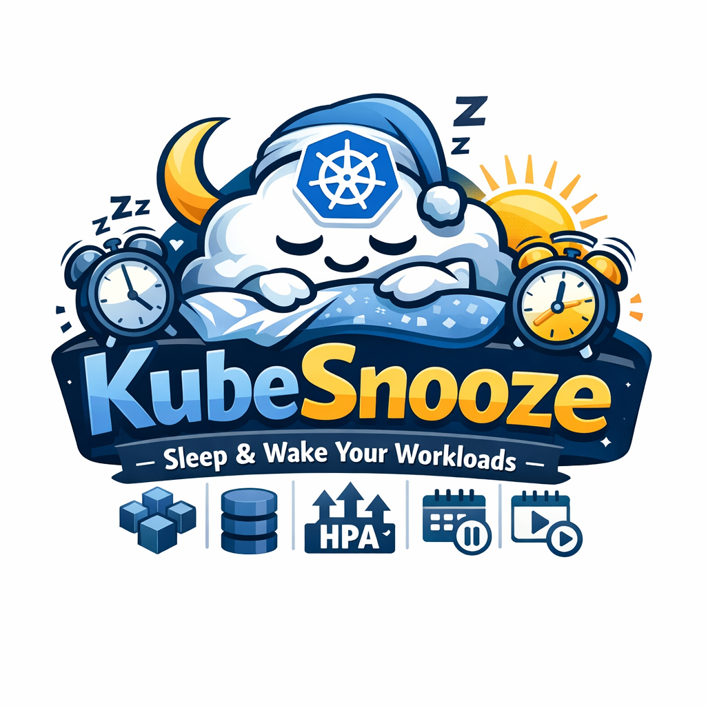

# KubeSnooze



KubeSnooze is a Kubernetes operator that schedules "sleep" and "wake" actions
for workloads in a namespace. It uses a single `KubeSnooze` custom resource to
define schedules and label selectors, then creates CronJobs that run a small
runner to scale Deployments, StatefulSets, HPAs, and suspend or resume CronJobs.

This is an MIT-licensed, open-source project and all APIs are under the
`kubesnooze.io` group with the `KubeSnooze` kind.

Thanks to Angie for helping with naming and logo.

## Core ideas

- Namespace-scoped CRD with label selector targeting.
- Two schedules: `sleepCron` and optional `wakeCron`.
- Runner-based execution via CronJobs with per-namespace RBAC.
- Annotations to restore original replica or HPA min values.
- Optional splash server that wakes workloads on request.

## Quick start

1. Apply the CRD:

```sh
kubectl apply -f config/crd/bases/kubesnooze.io_kubesnoozes.yaml
```

1. Deploy the controller (example manifest under `config/manager/manager.yaml`).

1. Apply a sample `KubeSnooze`:

```sh
kubectl apply -f config/samples/kubesnooze_v1alpha1_kubesnooze.yaml
```

## Sample KubeSnooze

```yaml
apiVersion: kubesnooze.io/v1alpha1
kind: KubeSnooze
metadata:
  name: app-snooze
  namespace: app-1
spec:
  selector:
    matchLabels:
      kubesnooze.io/snooze: app-1
  sleepCron: "0 20 * * 1-5"
  wakeCron: "0 7 * * 1-5"
  timezone: "UTC"
  runnerImage: "ghcr.io/kubesnooze/kubesnooze-runner:latest"
  sleep:
    replicas: 0
    hpaMinReplicas: 1
    suspendCronJobs: true
  wake:
    replicas: 2
    hpaMinReplicas: 2
    suspendCronJobs: false
```

## Splash page

You can deploy the optional splash page server to show a "waking up" UI that
triggers a wake action on each request. Update the image name in the sample
manifest to point at your built `kubesnooze-splash` image.

```sh
kubectl apply -f config/samples/kubesnooze_splash.yaml
```

The splash server supports service-based wake modes:

- `KUBESNOOZE_SERVICE_MODE=selector` (default): use `KUBESNOOZE_LABEL_SELECTOR`
- `KUBESNOOZE_SERVICE_MODE=service`: use `KUBESNOOZE_SERVICE_NAME`
- `KUBESNOOZE_SERVICE_MODE=all`: wake workloads for every Service selector

You can also pass `?service=your-service-name` to target a single Service.

## Contributing

This repo requires PRs for all changes except the repository owner. CI enforces
Conventional Commits and reports the required semver bump based on commit
messages and the latest git tag. See `CONTRIBUTING.md` for branch protection
and CI setup.
